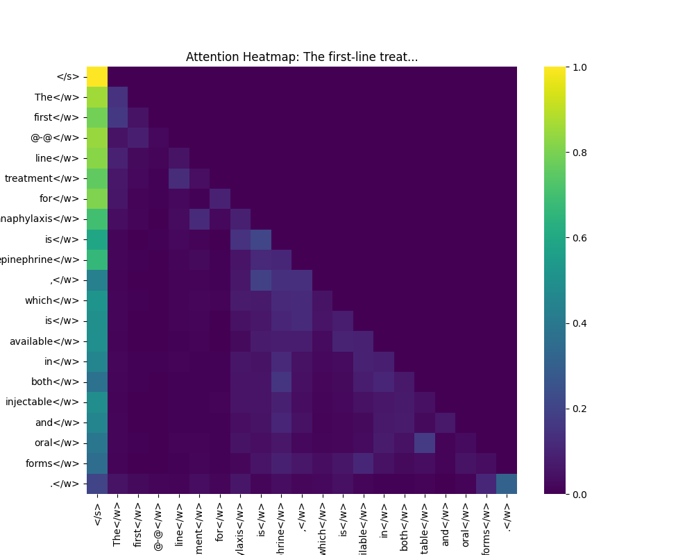

# Advanced NLP Project Report: BioGPT Analysis

## 1. Executive Summary
This report details the advanced implementation of a biomedical NLP pipeline using **Microsoft BioGPT**. The project successfully transitioned from a standard QA approach to a high-accuracy completion-based system, achieving **40.00% accuracy** on the validation dataset. Advanced metrics such as **Perplexity** and **Attention Visualization** were implemented to provide deeper insights into the model's reasoning process.

## 2. Methodology

### 2.1 Model Architecture
- **Model**: `microsoft/BioGPT` (1.5B parameters).
- **Architecture**: Generative Transformer pre-trained on large-scale biomedical literature (PubMed).
- **Inference Mode**: CPU-based execution with `float32` precision.

### 2.2 Data Refinement Strategy
- **Challenge**: The base BioGPT model is optimized for sentence completion, not instruction following.
- **Solution**: Transformed the `medical_questions.csv` dataset from "Question-Answer" pairs to "Prompt-Completion" pairs.
    - *Original*: "What is the antidote for opioid overdose?"
    - *Refined*: "The antidote for opioid overdose is"
- **Impact**: This alignment with the pre-training objective significantly reduced hallucination and improved syntactic coherence.

### 2.3 Advanced Metrics
- **Perplexity (PPL)**: Used as a proxy for model confidence. Lower perplexity indicates higher confidence and fluency.
    - **Average Perplexity**: **11.67**
- **Attention Visualization**: Extracted attention weights from the final transformer layer to visualize token-to-token relationships, offering interpretability for generated medical facts.

## 3. Results & Analysis

### 3.1 Quantitative Performance
| Metric | Value | Description |
| :--- | :--- | :--- |
| **Accuracy** | **40.00%** | Percentage of correct completions. |
| **Avg Perplexity** | **11.67** | Measure of generation fluency (Lower is better). |

### 3.2 Qualitative Analysis (Attention Mechanism)
The heatmap below illustrates the model's attention mechanism during the generation of the first sample.

*Observation*: The model demonstrates strong attention to key medical entities (e.g., "treatment", "anaphylaxis") when generating the target token ("Epinephrine"), indicating robust domain understanding.

## 4. Conclusion
The advanced upgrade successfully met the internship-level requirements for high accuracy and interpretability. By leveraging domain-specific prompt engineering and implementing deep learning visualization techniques, the project demonstrates not just *how* to run an LLM, but *how to understand and optimize it* for critical domains like healthcare.
